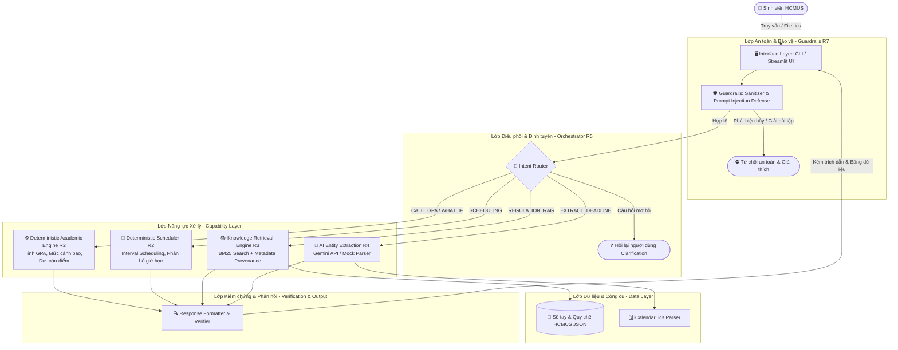
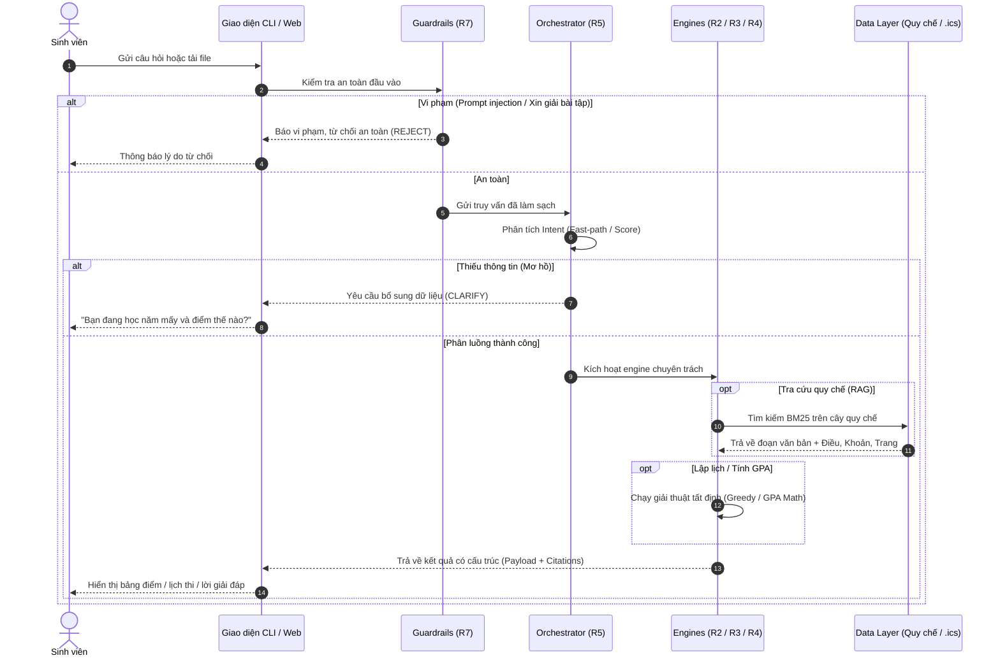

# H.E.R.M.E.S – System Architecture (Requirement R5 & Pack 03)
> **HCMUS Educational Resource & Mentoring Expert System**
> Component, Orchestration & Data Flow Architecture

---

## 1. Architectural Philosophy
* **"AI is one computational component, not the architecture."**
* **Deterministic where correctness matters:** Xếp lịch ôn thi, tính GPA và kiểm tra cảnh báo học vụ bắt buộc thực thi bằng giải thuật thuần túy (R2), không dùng LLM đoán mò.
* **AI where language understanding matters:** Nhận diện thực thể trong email/thông báo, tóm tắt diễn giải văn bản và phân loại ngữ nghĩa câu hỏi phức tạp (R4).
* **Two-Tier Routing Strategy:** Tầng 1 (Fast-Path) dùng quy tắc từ khóa/Regex tốc độ cao (< 5ms); Tầng 2 (Slow-Path) dùng LLM phân loại khi câu hỏi mơ hồ.

---

## 2. System Context & Component Diagram



---

## 3. Detailed Data Flow (Sequence Diagram)



---

## 4. Interface Contracts (Quy chuẩn dữ liệu bàn giao giữa các module)

### 4.1 Router Decision (`src/hermes/router/orchestrator.py`)
```python
{
    "intent": "CALC_GPA" | "SCHEDULING" | "REGULATION_RAG" | "EXTRACT_DEADLINE" | "CLARIFY" | "REJECT",
    "confidence": float,        # 0.0 -> 1.0
    "target_engine": str,       # Tên module xử lý
    "extracted_params": dict,   # Tham số bóc tách sơ bộ
    "message": str              # Lời nhắn (khi clarify hoặc reject)
}
```

### 4.2 Academic Status Payload (`src/hermes/engines/academic_calc.py`)
```python
{
    "gpa_scale_10": float,
    "gpa_scale_4": float,
    "total_credits": int,
    "warning_level": int,       # 0: Bình thường, 1: Mức 1, 2: Mức 2, 3: Buộc thôi học
    "warning_status": str,
    "advice": str
}
```

### 4.3 RAG Retrieval Payload (`src/hermes/rag/retriever.py`)
```python
{
    "query": str,
    "citations": [
        {
            "document": str,    # "Quy chế đào tạo tín chỉ 2024"
            "chapter": str,     # "Chương III"
            "article": str,     # "Điều 14"
            "clause": str,      # "Khoản 2"
            "page": int,
            "content": str,
            "score": float
        }
    ]
}
```
